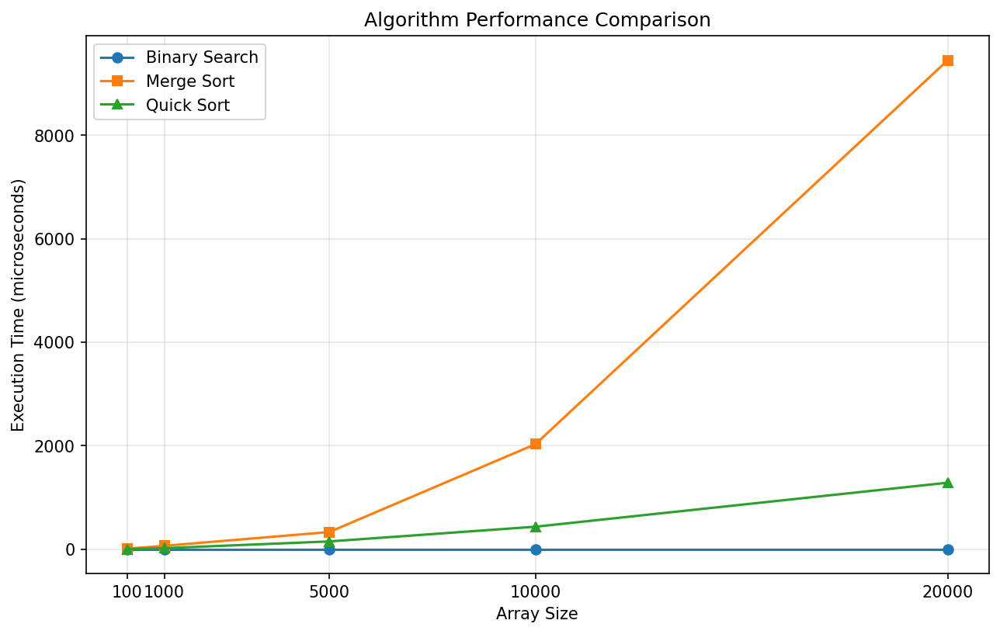

# Algorithm Analysis

**AUTHOR**: Mert Eldemir

## Work 1

This repository contains the Work 1 solution for the algorithm analysis assignment.

## Folder Structure

```text
Work-1/
    |-- Directives/
    |-- Solution/
        |-- app                            # compiled executable output
        |-- include/                       # shared C++ headers
        |   |-- algorithms.h
        |   |-- utils.h
        |-- src/
        |   |-- main.cpp                   # benchmark entry point
        |   |-- algorithms/
        |   |   |-- BinarySearch.cpp
        |   |   |-- MergeSort.cpp
        |   |   |-- QuickSort.cpp
        |   |-- utils/
        |       |-- utils.cpp              # random/sorted array helpers
        |-- analysis/
            |-- analysis.ipynb             # creates plots from benchmark output
            |-- requirements.txt
            |-- time_results/
                |-- results.csv            # raw timing results from C++ run
                |-- performance_chart.png  # notebook-generated chart
```

## What Was Done

- Implemented Binary Search, Merge Sort, and Quick Sort in C++.
- Added a benchmark in `main.cpp` to measure execution time.
- Saved timing results in CSV format.
- Created a simple notebook to plot the graph required by the directive.

<br>



## How to Run the C++ Program

From the `Solution` folder:

```bash
cd Algorithm-Analysis-COME206/Work-1/Solution
g++ -std=c++17 -O2 -Iinclude src/main.cpp src/algorithms/*.cpp src/utils/*.cpp -o app
./app
```

## How to Run the Notebook

From the `analysis` folder:

```bash
cd Algorithm-Analysis-COME206/Work-1/Solution/analysis
python3 -m venv .venv
source .venv/bin/activate
pip install -r requirements.txt
```

Then select the `.venv` kernel for `analysis.ipynb`, and run the notebook.

If you want to open it from the terminal after the kernel is ready:

```bash
jupyter notebook analysis.ipynb
```
